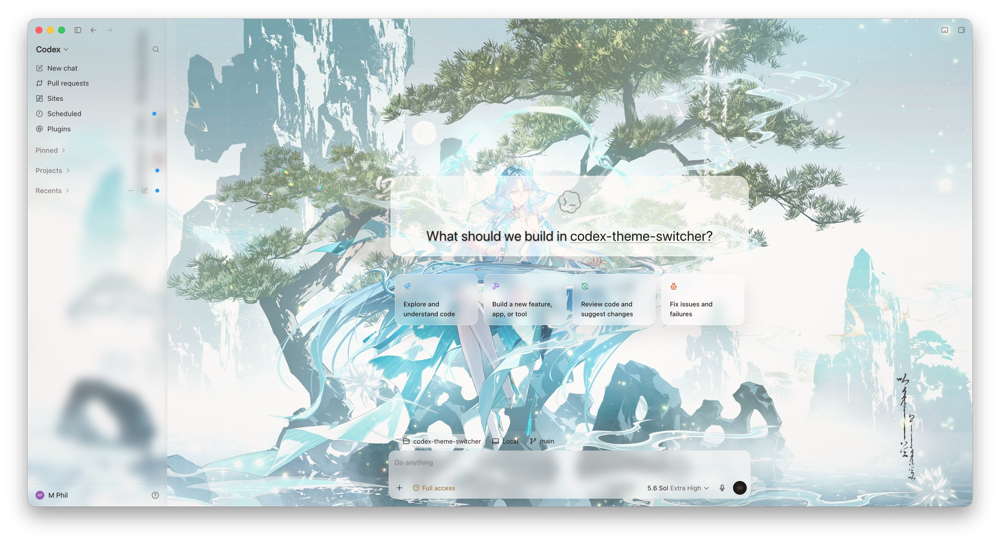
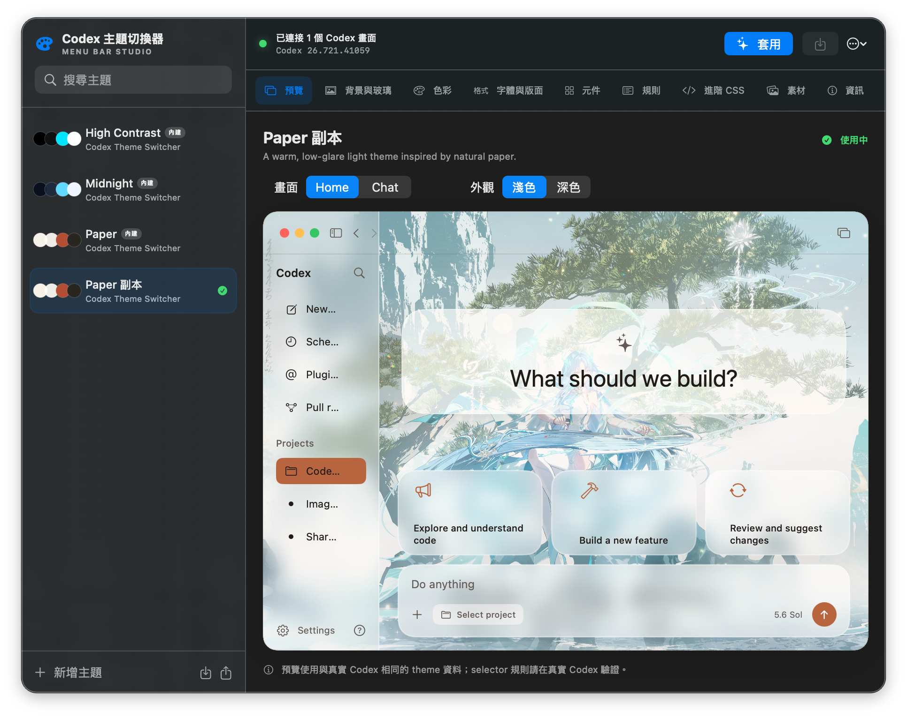
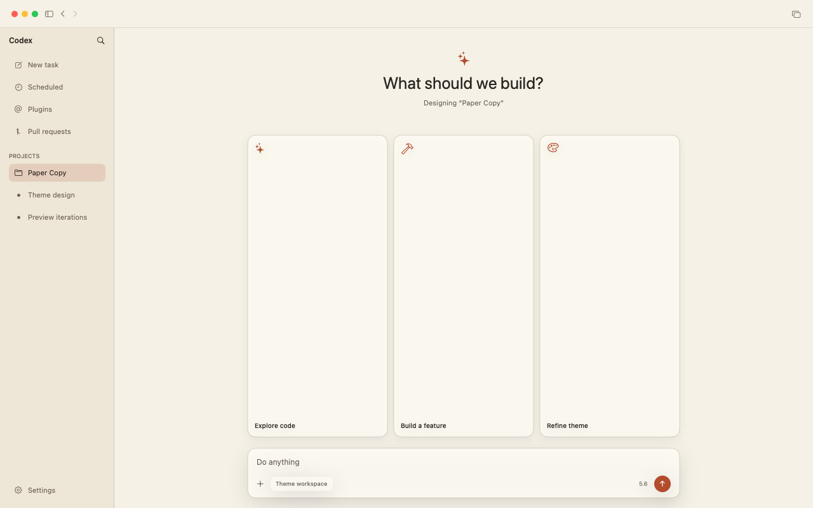
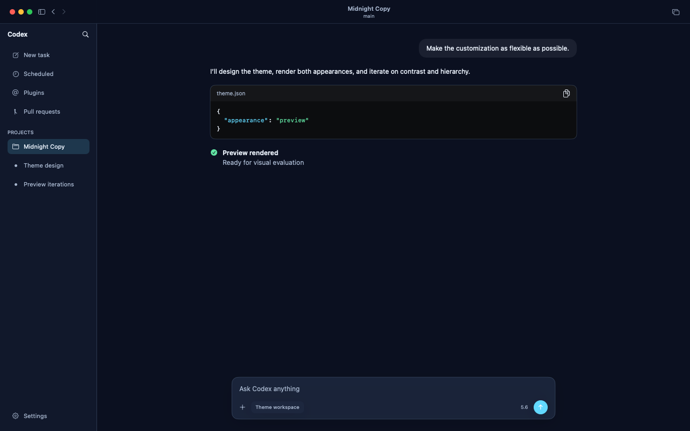

# Codex Theme Switcher

**English** | [繁體中文](README.zh-Hant.md) | [简体中文](README.zh-Hans.md) | [Français](README.fr.md) | [Español](README.es.md) | [日本語](README.ja.md) | [한국어](README.ko.md)



A native macOS menu bar theme studio. It does not create a conventional main window, does not
appear in the Dock, and does not modify, re-sign, or overwrite `Codex.app` / `ChatGPT.app`.

Theme Switcher connects to the Codex renderer through the Chromium DevTools Protocol (CDP) and
writes compiled CSS into a namespaced `<style>`. Theme changes are synchronized to all Codex
windows in real time; the runtime also automatically restores the theme after Codex reloads or
opens a new window.

## Screenshots

### Menu Bar Theme Studio



### Agent Renderer Preview

| Paper · Light / Home | Midnight · Dark / Chat |
| --- | --- |
|  |  |

The Agent CLI can generate Light/Dark × Home/Chat PNGs in a headless environment for iterative
inspection by AI agents. These are structured approximations; selector rules, raw CSS, and the
final rendering in Codex should still be verified after applying the theme.

## Features

- A menu bar-only app; the entire theme library, editor, preview, and runtime status live in the
  menu bar panel.
- Three built-in templates: Midnight, Paper, and High Contrast.
- Apply a theme, restore Codex's original styles, or reconnect to the renderer with one click.
- Finds Codex through a saved location, the running app, Launch Services, and common directories;
  Settings can also select a Codex app on an external disk or in any other folder.
- Visual color system:
  - Base semantic colors.
  - Codex `--color-token-*` interface, interaction, diff, and terminal tokens.
- Typeface, font size, line height, content width, spacing, corner radius, shadow, blur, scaling,
  and animation controls.
- Background and glass (Image Skin): separate light/dark backgrounds, seven sizing modes including
  Fit / Fill, focal-point cropping, an optional wallpaper canvas that spans the entire window or
  avoids the sidebar, filters, overlays, per-section glass, and a central content panel.
- Arbitrary component declarations.
- Arbitrary CSS selector rules.
- A complete raw CSS escape hatch.
- Multiple layers with light / dark / custom media queries.
- PNG, JPEG, WebP, GIF, fonts, and other assets can be embedded in templates; the runtime transfers
  them in chunks and creates renderer-local Blob URLs, so large 4K images do not hit CSS declaration
  length limits.
- Single-file `.codextheme` import/export for easy sharing.
- Automatically switches among English, Traditional Chinese, Simplified Chinese, French, Spanish,
  Japanese, and Korean according to the preferred macOS language; all other languages fall back
  to English.
- Sparkle 2 automatic updates: choose the Stable or Beta channel, receive the correct installer for
  Apple Silicon or Intel, and view release notes in the same seven languages.
- Checks for updates at launch and every 30 minutes afterward; updates can also be checked manually
  from Settings or the top-right menu, specific versions can be skipped, and manual download is
  available.
- Includes a JSON-first `codex-theme` agent CLI: AI agents can retrieve the schema/examples,
  validate, normalize, compile, install, export, and generate Light/Dark × Home/Chat PNG previews;
  only explicit calls to `attach`, `apply`, or `clear` modify Codex.

## Background and Glass / Image Skin

Image Skin can turn Codex into a complete image-based theme instead of merely replacing a color
palette:

- Light and Dark can each use a separate background image, or share one image with different
  effects.
- Backgrounds support Fit (show the entire image), Fill (crop proportionally to fill), Stretch,
  Fit Width, Fit Height, Original, and Tile; every mode can be combined with a focal point/origin,
  scale, opacity, and brightness, contrast, saturation, and blur filters.
- “Wallpaper avoids sidebar” lays out the image, Fit / Fill, focal point, overlay, scrim, and
  vignette as a group within the main content area; the sidebar retains its own background color
  and glass. When the sidebar is resized or collapsed, the wallpaper boundary automatically
  follows the actual Codex layout.
- Overlay can use a solid-color scrim, linear gradient, or vignette so the sidebar, headings, and
  composer remain legible over complex images.
- Glass fill, opacity, backdrop blur, border, corner radius, and shadow can be configured
  independently for the sidebar, main content, composer, card, menu, popover, and code block;
  changing panel opacity does not also fade the text.
- The “central content panel” independently wraps the Home Hero or Chat conversation history,
  excluding suggestion Cards and the Composer. Separate fill colors, borders, shadow colors, and
  opacities can be configured for Light and Dark; material controls include blur, saturation,
  border width, corner radius, shadow offset/spread, maximum width, and horizontal/vertical
  padding.
- The preview can switch between Light / Dark and Home / Chat, making it easy to check background
  cropping, text contrast, and component surfaces together.
- Backgrounds used by Image Skin are embedded in the `.codextheme`, so exported themes do not
  depend on original file paths and recipients can import them directly.

Visual controls generate portable theme variables and component overrides. When finer-grained
selectors, multiple gradients, blend modes, or animations are needed, Raw CSS can still override
everything at the end; Raw CSS retains the highest degree of freedom in the theme cascade.

Image Skin image fields accept only raster assets (PNG, JPEG, WebP, GIF, AVIF), with a 16 MB limit
per asset. The combined limit for all assets is 32 MB, and a single `.codextheme` is limited to
48 MB. Fonts can still be embedded through the advanced asset feature, but cannot be assigned as
Image Skin backgrounds.

## Workflow

1. Open the app and enter the theme studio from the palette icon in the macOS menu bar.
2. Click “Launch and Connect Codex”; the first connection may relaunch Codex.
   The first connection does not automatically apply the preselected template. Later reconnections
   restore the most recent successfully applied snapshot saved by the runtime; changes subsequently
   saved only to the repository, or left in a draft, are not included.
3. Apply a built-in template directly, or first “Make an Editable Copy”; you can also create a blank
   theme from the bottom-left corner.
4. Edit the Background & Glass, Colors, Typography & Layout, Components, Rules, Advanced CSS,
   Assets, and Info tabs. An orange dot means the theme still has unsaved changes; switching to
   another theme and back does not lose the draft.
5. Save, then apply. To share the theme, click Export to get a single `.codextheme` containing all
   embedded assets. Recipients can import it from the same location.
6. The Settings tab lets you enable or disable automatic updates, select Stable/Beta, check for a
   new version, and show “What’s New” for the current version again.

## Security Model

- Does not patch `app.asar`, preserving the OpenAI app's signature, notarization, and ASAR
  integrity.
- The Theme Switcher bridge listens only on `127.0.0.1` and uses a private 256-bit bearer token.
- `.codextheme` does not permit JavaScript.
- Import and compilation reject `@import`, `http:`, `https:`, protocol-relative, and `file:` URLs.
- Assets are embedded in the template; import does not extract a ZIP, so there is no path traversal
  / zip-slip risk.
- Image Skin backgrounds accept raster images only; each embedded asset is validated on import for
  its format, base64 data, and 16 MB size limit.
- The runtime and style ID both use the `codex-theme-switcher` namespace and do not clear other
  injection tools.
- The menu bar always provides “Restore Original Codex Styles,” so recovery remains possible even
  if custom CSS breaks the interface.
- The Agent CLI explicitly prohibits running `attach`, `apply`, or `clear` with a non-default
  `--root`; a custom root is only for an isolated repository and offline work, and cannot serve as
  a sandbox for the real Codex runtime.
- Chromium's CDP debug endpoint is also explicitly bound to `127.0.0.1`, but CDP itself does not
  provide bearer-token authentication; other local processes on the same Mac may still connect.
  If you no longer use the theming feature, quit Codex and reopen it normally so it no longer
  carries the remote-debugging arguments.

## Build

Requirements:

- macOS 13+
- Swift 6 toolchain
- Codex desktop app (the current unified app may also be located at `/Applications/ChatGPT.app`)
- Node.js 22+; the program first uses
  `Contents/Resources/cua_node/bin/node` bundled with the Codex app, then searches PATH / Homebrew
  Node

```sh
swift build
swift test
npm test
npm run check
swift run CodexThemeSwitcher
swift run codex-theme capabilities
```

Create a double-clickable menu bar `.app`:

```sh
scripts/package-app.sh
open dist/CodexThemeSwitcher.app
```

The generated `Info.plist` includes `LSUIElement=true`, so the app does not appear in the Dock or
the regular app switcher. The Agent CLI is packaged at
`CodexThemeSwitcher.app/Contents/Helpers/codex-theme`, while the JSON Schema is located in
`Contents/Resources/Schemas/`. See
[`docs/AGENT_API.md`](docs/AGENT_API.md) for the full protocol and examples. When no signing
identity is provided, the script uses ad-hoc signing; for production distribution, set:

```sh
CODESIGN_IDENTITY="Developer ID Application: Your Name (TEAMID)" \
SPARKLE_PUBLIC_ED_KEY="<base64 Ed25519 public key>" \
  scripts/package-app.sh
```

A production package must provide the Sparkle EdDSA public key. The script writes it to
`SUPublicEDKey` and rejects any `SUAllowsInsecureUpdates` setting. Only local ad-hoc development
packages include a local-only insecure allowance and must not be used for production releases.

## App Updates and Releases

- Stable feeds:
  `appcast-arm64.xml`, `appcast-x86_64.xml`
- Beta feeds:
  `appcast-beta-arm64.xml`, `appcast-beta-x86_64.xml`
- Update feeds always live in the latest Stable Release on GitHub; a Beta release only replaces
  the `appcast-beta-*` files there, so the fixed URL does not break when GitHub excludes
  prereleases.
- Every appcast enclosure must have a `sparkle:edSignature`, and production apps must also contain
  the corresponding `SUPublicEDKey`.
- The seven release-note files live at
  `docs/release-notes/v<version>/release-notes.<language>.md`.

See [`docs/UPDATES.md`](docs/UPDATES.md) for complete details on secrets, signing, notarization, and
the release process.

## First Connection

Codex does not open a CDP port when launched normally. The first time you click “Launch and Connect
Codex,” if no shareable Codex debug target is available, Theme Switcher first asks Codex to quit
normally and then relaunches it with the following arguments:

```text
--remote-debugging-address=127.0.0.1
--remote-debugging-port=57340
--remote-allow-origins=http://127.0.0.1:57340
```

If `codex-desktop-switcher` has already created a Codex target between ports 57330–57341, this
program shares it instead of relaunching Codex.

## `.codextheme` Format

`.codextheme` is a versioned, single JSON envelope:

```json
{
  "format": "com.codex-theme-switcher.theme",
  "archiveVersion": 1,
  "exportedAt": "2026-07-25T00:00:00Z",
  "theme": {
    "schemaVersion": 1,
    "id": "9d9028d5-f76a-4e99-a5e5-da3533fe646d",
    "metadata": {
      "name": "My Theme",
      "author": "Author",
      "description": "",
      "version": "1.0.0",
      "tags": ["dark", "glass"],
      "createdAt": "2026-07-25T00:00:00Z",
      "updatedAt": "2026-07-25T00:00:00Z"
    },
    "layers": [],
    "assets": []
  }
}
```

Ready-to-import files are available at
[`Examples/minimal.codextheme`](Examples/minimal.codextheme) and
[`Examples/full.codextheme`](Examples/full.codextheme). Agents can use
[`codextheme.schema.json`](Sources/CodexThemeAgentCLI/Resources/codextheme.schema.json) to generate
and validate JSON; dates are always emitted as ISO-8601, while imports remain compatible with
numeric dates from older Foundation versions. The JSON Schema also accepts both date input forms
and provides fast checks for structure, enums, and numeric ranges; the Core validator remains the
final authority for CSS security scanning and total size limits.

The theme cascade order is fixed:

1. semantic variables and Codex stable-token aliases
2. advanced/custom variables
3. component overrides
4. selector rules
5. background, palette, and glass rules generated by Image Skin
6. raw CSS

Items 1–4 are compiled in layer order; Image Skin then overrides the structured interface settings,
and raw CSS is emitted last in layer order, making Raw CSS the true final escape hatch. When an
imported theme has an ID conflict, it is cloned with a new UUID by default and is not automatically
applied.

Embedded assets are referenced in CSS with:

```css
body {
  background-image: theme-asset("ASSET-UUID");
}
```

During compilation, this is safely rewritten to a short `codex-theme-asset://` placeholder. The
runtime sends assets to each renderer in 256 KiB chunks and creates Blob URLs inside the renderer
before atomically switching the style; identical assets reuse the same Blob, and URLs that are no
longer used are revoked when switching or clearing themes.

## Local Data

```text
~/Library/Application Support/CodexThemeSwitcher/
  Themes/                 # user theme JSON
  active-theme.json       # repository active pointer
  Runtime/
    active-theme.json     # runtime CSS template、asset manifest 與資料
    bridge-token          # mode 0600
  Logs/runtime.log
```

## Architecture

- `CodexThemeSwitcherCore`: theme schema, validator, compiler, repository, and archive.
- `CodexThemeRuntime`: async Swift runner and authenticated Node/CDP runtime.
- `CodexThemeSwitcher`: AppKit/SwiftUI menu bar studio.
- `codex-theme`: structured JSON CLI and headless PNG renderer for AI agents and automation.
- `Tests/`: Swift test suites.
- `test/`: Node runtime test suites.

Selector rules are an expert layer and may need adjustment after Codex updates. The base and
`--color-token-*` layers primarily use Codex's current CSS contract and depend less on React class
names.
