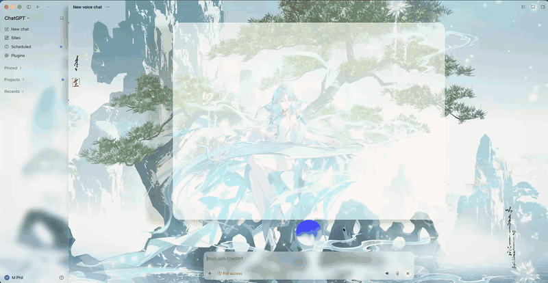

# Codex Theme Switcher

[English](README.md) | **繁體中文** | [简体中文](README.zh-Hans.md) | [Français](README.fr.md) | [Español](README.es.md) | [日本語](README.ja.md) | [한국어](README.ko.md)

[](https://github.com/irons163/codex-theme-switcher/raw/refs/heads/main/docs/media/codex-theme-switcher-demo.mp4)

原生 macOS menu bar app，可為 Codex／ChatGPT 桌面版設計、預覽、套用與分享主題。

Theme Switcher 會在啟動 Codex 時暫時注入樣式，不會修改、取代或重新簽署原始 App。

## 下載

**目前穩定版：0.3.1**

[Apple Silicon DMG](https://github.com/irons163/codex-theme-switcher/releases/download/v0.3.1/CodexThemeSwitcher-0.3.1-apple-silicon.dmg)
·
[Intel DMG](https://github.com/irons163/codex-theme-switcher/releases/download/v0.3.1/CodexThemeSwitcher-0.3.1-intel.dmg)
·
[版本說明與檢查碼](https://github.com/irons163/codex-theme-switcher/releases/tag/v0.3.1)

需要 macOS 13 或以上版本。兩種安裝檔均已簽署並通過 Apple 公證。

## 主要功能

- Menu bar 主題庫、編輯器、即時預覽與連線狀態。
- 色彩、字型、間距、圓角、陰影、模糊、縮放與動畫。
- Light／Dark 背景圖片、Fit／Fill、焦點、濾鏡、遮罩與玻璃效果。
- 實驗性 ChatGPT Voice 背景、圓球樣式、動態人物、嘴型、眨眼與待機動作。
- 進階元件設定、selector 規則、自訂變數與 raw CSS。
- 單一 `.codextheme` 檔案導入／導出，並內嵌圖片與字型。
- 英文、繁體中文、簡體中文、法文、西班牙文、日文與韓文。

## 快速開始

1. 安裝並開啟 Codex Theme Switcher，再點擊 macOS menu bar 上的圖示。
2. 按下 **啟動並連接 Codex**。第一次連接可能會重新啟動 Codex。
3. 選擇內建主題、製作可編輯副本，或建立新主題。
4. 調整設計，並用 Light／Dark 與 Home／Chat 預覽檢查效果。
5. 儲存主題，再按 **套用** 傳送到 Codex。
6. 使用 **導出** 分享 `.codextheme`；使用 **導入** 安裝別人分享的主題。

第一次連接不會自動套用目前選取的主題。之後重新連接會恢復上次成功套用的主題，不包含尚未套用的草稿變更。

## 截圖

### 主題工作室


### Renderer 預覽

| Paper · Light / Home | Midnight · Dark / Chat |
| --- | --- |
|  |  |

Agent 產生的預覽是接近真實畫面的近似結果。分享主題前，請在實際 Codex App 中確認進階 CSS 與 selector 規則。

## 客製化指南

### 背景與玻璃

- Light 與 Dark 可使用不同圖片，也可共用圖片並設定不同效果。
- 支援 Fit、Fill、Stretch、Fit Width、Fit Height、Original 與 Tile，再搭配焦點與縮放。
- 圖片透明度與濾鏡可和側欄、內容區、輸入框、卡片、選單及程式碼區塊的玻璃效果分開控制。
- 壁紙可鋪滿整個視窗，或排除左側欄。
- 可加入獨立的中央內容面板，調整底色、邊框、陰影、模糊、圓角、寬度與內距。

### ChatGPT Voice（實驗性）

- 設定 Voice 背景，以及動畫圓球內的獨立圖片。
- 加入閉嘴人物與最多八張嘴型圖，或直接導入 2×2／3×3 嘴型圖。
- 調整靈敏度、靜音門檻、張嘴／閉嘴速度、眨眼、待機動作、脈動與原生圓球顯示程度。
- 嘴型會跟隨音量強度，不是音素級對嘴。

Voice 樣式依賴 ChatGPT 內部 renderer，Codex／ChatGPT 更新後可能需要跟著調整。

## 導入與導出

- 導出會建立一個包含主題設定及內嵌素材的 `.codextheme`。
- 導入主題後不會自動套用；請先檢查，再按 **套用**。
- Image Skin 支援 PNG、JPEG、WebP、GIF 與 AVIF。
- 限制：每個素材 16 MB、全部素材合計 32 MB、每個 `.codextheme` 48 MB。

範例：[`minimal.codextheme`](Examples/minimal.codextheme) 與 [`full.codextheme`](Examples/full.codextheme)。

## 使用 AI Agent 設計

安裝 App 後，將以下提示貼給 AI agent：

```text
請使用以下 Agent CLI 幫我設計 Codex theme：
/Applications/CodexThemeSwitcher.app/Contents/Helpers/codex-theme

先執行 capabilities 與 schema，完成 validate、compile 和四張預覽。
未經我確認不要套用。
```

CLI 可建立、驗證、編譯、導入、導出，並產生 Light／Dark × Home／Chat 預覽。只有明確執行 `attach`、`apply` 或 `clear` 才會改變 Codex。

完整指令請見 [`docs/AGENT_API.md`](docs/AGENT_API.md)。

## 語言與更新

- App 預設跟隨 macOS 語言；不支援的語言會改用英文。
- 可在 **設定 → 介面語言** 手動選擇語言。
- 可在設定中選擇 Stable 或 Beta 更新頻道。
- 更新使用 Sparkle，會自動提供 Apple Silicon 或 Intel 對應版本。

## 安全與還原

- Theme Switcher 不會修改 `app.asar`，也不會取代 Codex／ChatGPT 檔案。
- 主題資料與連線 bridge 都留在本機 Mac。
- 導入的主題不能執行 JavaScript，也不能載入遠端或本機檔案 URL。
- 若自訂 CSS 讓 Codex 無法閱讀，請從 menu bar App 選擇 **恢復 Codex 原始樣式**。
- 關閉 Codex 並以一般方式重新開啟，即可移除暫時注入的樣式。

這是獨立專案，與 OpenAI 無合作或背書關係。

## 從原始碼建置

需求：macOS 13+、Swift 6、Node.js 22+，以及 Codex／ChatGPT 桌面版。

```sh
swift build
swift test
npm test
scripts/package-app.sh
open dist/CodexThemeSwitcher.app
```

開發文件：

- [Agent CLI](docs/AGENT_API.md)
- [更新、簽署、公證與發布](docs/UPDATES.md)
